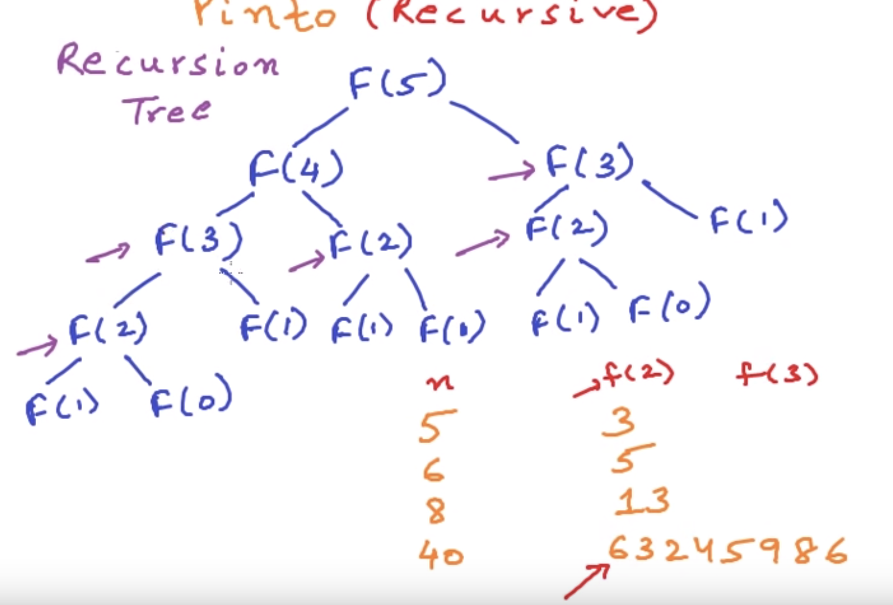
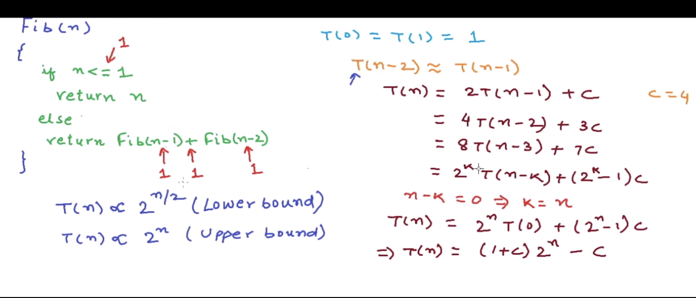

Recursion problem:
Write a neat pseudo code
- recursive relation
- base case

Recursion is not always good
- Fibonacci example.
  <!-- - Iterative is fast. (implement and time it). O(n) -->
  - Recursive is slow. (implement and time it). O(2^n) time. O(n) space
    - Space complexity is O(n). Would be max depth of tree in general recursion case. Here max depth is n. Max depth corresponds to max number of function pushes into stack at any given instant. This also is the max memory consumed. https://www.youtube.com/watch?v=dxyYP3BSdcQ
    - Write a program to find how many times any random number's recursive calls are executed
    - Something like - 
    - In below image. Upper bound by assuming T(n-2)=T(n-1). Lower bound by assuming T(n-1)=T(n-2). Big O considers the upper bound. So O(2^n)
    - 
  - DP might be fastest. Check (Memoized recursion) (implement and time it)
