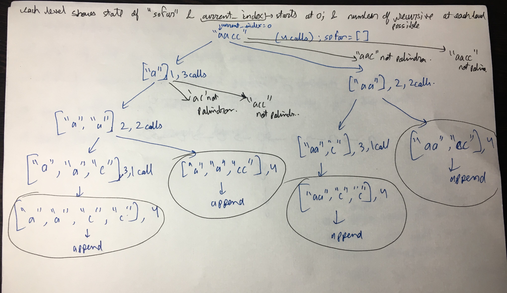

Brute force.
Generate all partitions and check if each of them are palindrome or not.
All ways to generate partition and code for this-
https://stackoverflow.com/questions/37023774/all-ways-to-partition-a-string

Backtracking.
Worst case running time- O(n*2^n). There would be 2^n call when input of length n is of form "aaaaa". Each call takes O(n) time

Space- Max depth of tree n. Hence O(n)

Some DP solution which only takes O(n^2) time exists-
https://leetcode.com/problems/palindrome-partitioning/discuss/?currentPage=1&orderBy=most_votes&query=

Should i pass soFar by value or reference? What is better? Both give AC (accepted solution)

void partitionHelper(vector<vector<string>> &result,vector<string> soFar, int current, string A)
