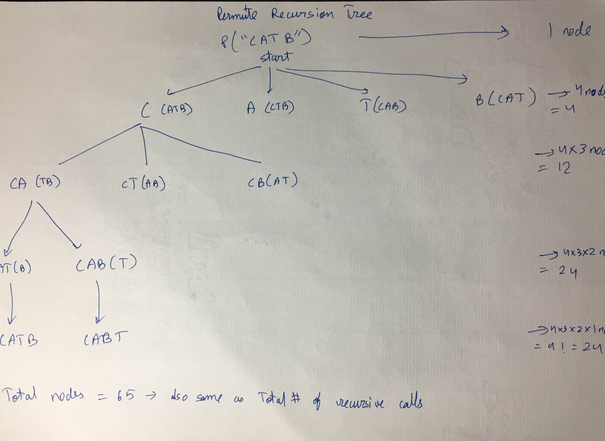

Depth of tree is number of decisions make- that is length of string. (same for subsets problem)
At each level, number of branches created decrease by one. (in subsets problem, it remains 2 at each node/each level). Subsets tree is like a binary tree.

Side note- n! grows faster than constant exponential (like pow(2,n))
