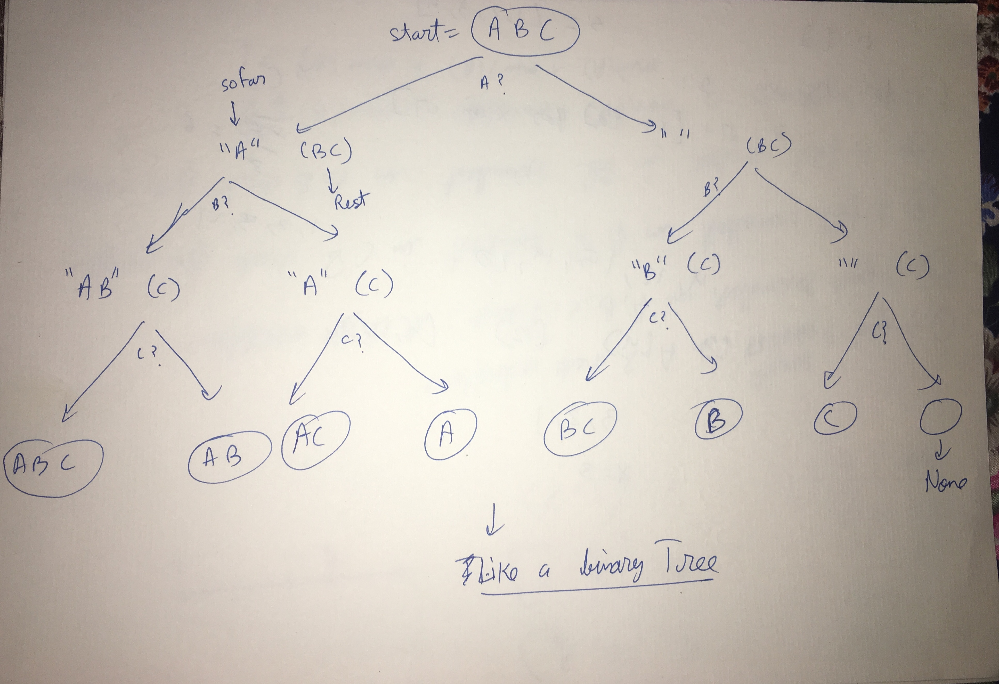

sol3.py is not clear

sol1.py is fine
sol2.py is fastest
sol4.py is recursive. pic1 is based on sol4.py

sol1.cpp is cpp version of sol2.py

sol2.cpp
Based on recursion. Same as sol4.py
In sol2.cpp, i have passed vectors by value. My understanding till now says backtracking prefers things being passed by value. Becuase we often come back to higher node in tree, and wouldn't want to be affected by data mofications in lower nodes of tree. Strangely my code gives same answer even if i change to pass by reference. Not sure why
